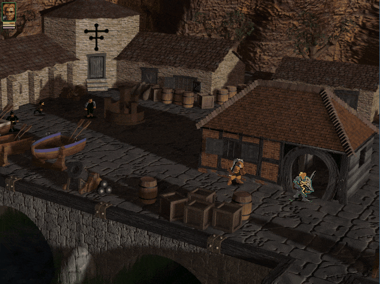
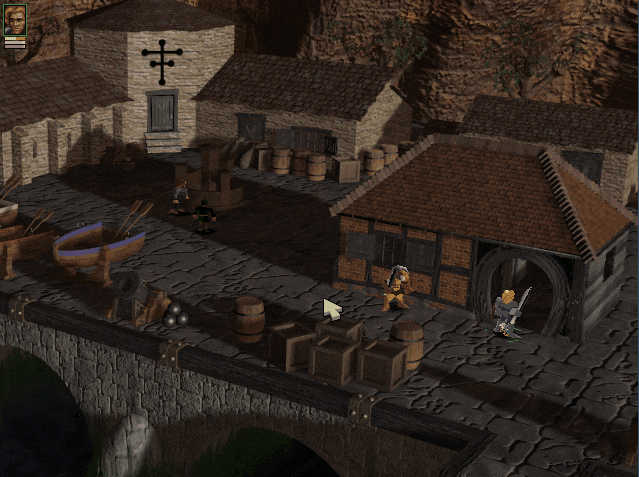
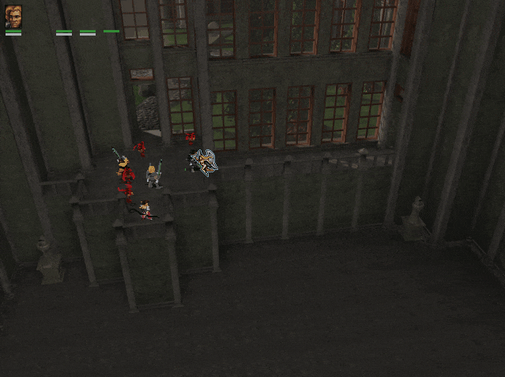
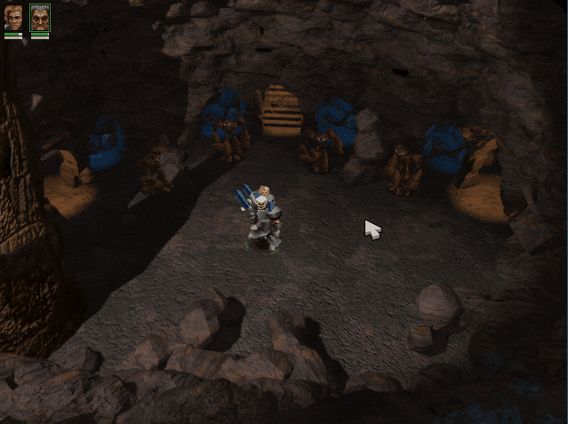

[<- Go Back](../readme.md)

# Examples:

##  Get all items

## Teleport all chars in the room to wherever you want

## Teleport from any room/ level to any room/ level

## Save whenever you want

## Teleport your character

## Vac all enemies to match the player's position

## Unlock the doors whenever you want

## Change the story to have a happy ending :)
